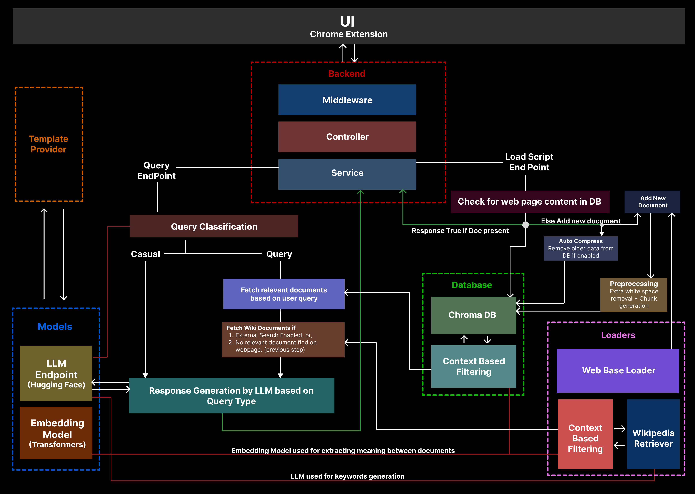

# WebPage Chatbot
A Chrome extension chatbot that answers user queries based on the content of the currently open webpage. The project features a chatbot UI as a Chrome extension, integrated with a Retrieval-Augmented Generation (RAG) backend built using FastAPI. It uses Hugging Face models and Wikipedia retrieval to provide contextual responses.

### Key Features
- `Contextual Responses:` Provides answers based on the content of the webpage you are viewing.
- `External Search:` When enabled by the user, Backend uses Wikipedia to fetch additional information based on the user query before responding.
- `Automatic Fallback:` If webpage content is insufficient, the chatbot automatically performs external searches even if it is not enabled.
- `Model Behavior:` Can Explain, Summarize or give one-line answers based on user selection.
- `In-built Context based Filtering:` Filters out irrelevant information to provide accurate responses. It involves optimizations at database as well as retriver level.
- `Efficient Resource Management:` Caches and manages webpage content to maintain performance and limit database size.
- `Additional Attribution:` The chatbot informs users when answers are based on external sources, especially if external search was performed automatically or fallback was triggered. Same thing applied if external search fails but was requested by user. This ensures transparency about the source of information.

## Installation
### Prerequisites
Make sure you have following installed in your system:
1. Node.js (21.7 used in this project)
2. Conda (25.9 used in this project) (Recommended) or Python 3.11+
3. Hugging Face API Key (You can create one by signing up at Hugging face website)

### Setup
1. Clone the repository:
   ```bash
    git clone git@github.com:mohitdixit02/webpage-chatbot.git
    cd webpage-chatbot
    ```

2. Backend Setup:
    - Enter into the backend directory:
        ```bash
        cd backend
        ```
    - If you have conda installed, create a conda environment:
        ```bash
        conda env create -f environment.yml
        conda activate webpage-chatbot
        ```
    - If you don't have conda, create a virtual environment using venv. For windows:
        ```bash
        python -m venv venv
        .\venv\Scripts\activate
        pip install -r requirements.txt
        ```
    - Create a env file by referencing the `env.example` and add your Hugging Face API key in `HF_TOKEN`. 
        - For `FRONTEND_URL`, you can use the default one in `env.example`.
        - For `BACKEND_EXTENSION_AUTH_ID`, you can generate a random value on your own. Make sure its the same in both frontend and backend env files.
        - For `HF_CACHE_DIR`, provide a valid path in your system where you want to store the Hugging Face models cache. Currently, Embedding Model run locally based on the `transformers` module.
        - For `Settings` related env variables, you can use the default values provided in `env.example` or modify them as per your requirements. For more details related to terms, you can check the `Settings and Configurations` section.

    - Make sure you are in the activated environment and run the backend server:
        ```bash
        uvicorn app:app --host 127.0.0.1 --port 8000
        ``` 

3. Frontend Setup:
    - Open a new terminal and navigate to the frontend directory:
        ```bash
        cd ../webchatbot
        ```
    - Install the dependencies:
        ```bash
        npm install
        ```
    - Create a env file by referencing the `env.example` and add your `BACKEND_EXTENSION_AUTH_ID` in it. Make sure its the same in both frontend and backend env files. For `REACT_APP_NODE_ENV`, use `production` before building the extension. For `REACT_APP_SERVER_URL`, use the backend server url.

    - Build the extension:
        ```bash
        npm run build
        ```
    - Load the extension in Chrome:
        - Open Chrome and go to `chrome://extensions/`
        - Enable "Developer mode" using the toggle on the top right.
        - Click on "Load unpacked" and select the `build` folder inside the `webchatbot` directory.

    Note: Use `development` in `REACT_APP_NODE_ENV` only if you want to run it for testing. Make sure to change it to `production` before building the extension for actual use.


## Project Architecture


### Backend (FASTAPI):
- Handles requests from the Chrome extension.
- Integrates with Hugging Face models for generating responses.
- Middleware ensures that the requests are from respective chrome extension.

### Template Provider: 
Provides prompt templates based on different requirements like:
- Model Behaviour Expectations (Explain, Summarize, One-liner)
- Casual or Query specific tone for final text generation
- Templates for Query Classification and keyword extraction tasks.
- Additional information in case of fallback or error scenarios

### Loaders
- `Webbase Loader:` Extracts the content from the currently open webpage. It uses `BeautifulSoup` for HTML parsing.
- `Wikipedia Retriever:` Fetches relevant articles from Wikipedia based on user queries when external search is enabled or fallback is triggered.
- `Context based Filtering:` Filters out irrelevant information before sending the final context doc to LLM. For detail explanation check: Challenges and Optimizations section.

### Database:
- `Chroma DB` is used to store the embeddings of the webpage content.
- `Context based Filtering:` Filters out irrelevant information before sending the final context doc to LLM. For detail explanation check: Challenges and Optimizations section.

### Models:
- `Embedding Model:` 
    - Uses Hugging Face's `sentence-transformers/all-MiniLM-L6-v2` model for generating embeddings. It currently runs locally using `transformers` module.
    - It is used
        - By `Chroma DB` for storing embedding vectors
        - By `context based filtering` to find the relevance between documents and user query.

- `LLM Model:` 
    - Uses Hugging Face's `meta-llama/Llama-3.1-8B-Instruct` model for generating responses. It is used via Hugging Face API.
    - It is used for multiple tasks like
        - Query Classification
        - Keyword Extraction for Wikipedia search
        - Final Text Generation based on context documents.

### API Endpoints:
- Loading Scripts:
    - Check whether the requested webpage is already in database or not.
    - If not, it loads the webpage content, preprocesses it and stores the embeddings in Chroma DB.
- Query:
    - Handles user queries from the Chrome extension.
    - If user question is casual, it directly generates response using LLM.
    - If user question is query specific, it retrieves relevant documents from Chroma DB. If no relevant documents found based on query, fallback is triggered.
    - If external search is enabled or fallback is triggered, it fetches additional information from Wikipedia
    - Finally, it generates a response using LLM based on the retrieved context documents.

### Additional Features:
- Model Behaviour:
    - Users can select how they want the model to respond: Explain, Summarize or One-liner.
    - The prompt templates are adjusted accordingly to guide the LLM.
    - Behaviours are:
        - Explain: Provides detailed explanations.
        - Summarize: Gives concise summaries.
        - One-liner: Responds with one-line answer.

- External Search:
    - Users can enable or disable external search via a toggle in the chatbot UI.
    - When enabled, the backend fetches additional information from Wikipedia based on user queries, else it only uses webpage content.
    - If the webpage content is insufficient to answer the query, the backend automatically performs external search even if it is disabled by user (Fallback).

- Additional Attribution:
    - The chatbot informs users when answers are based on external sources, especially if external search was performed automatically or fallback was triggered.
    - Same thing applied if external search fails but was requested by user. It also appologies if both webpage content and external search fails to provide relevant information.
    - This ensures transparency about the source of information as well as enhances user experience.

- Auto Compression of Webpages in Database:
    - To manage database size and to prevent multiple requests for same webpage, an auto-compression mechanism is implemented.
    - At a given time, only the latest k webpages are stored in the database, which is configurable as an environment variable.
    - This keeps database size in control, while still preventing multiple requests for same webpage within a short duration.

## Challenges and Optimizations
### Query Classification
- Challenge: Sometimes, user says a casual greeting or makes a small talk, which doesn't require any context from webpage. If we try to fetch context for such queries, it may lead to irrelevant or incorrect answers by LLM.
- Solution: A extra layer of query classification is added before fetching context documents. If the user query is classified as casual, it directly generates response using LLM without fetching any context.

### Context based Filtering
- Challenge - In the basic version, documents are fetched from database as well as from wikipedia retriver based on similarity score with user query. However, sometimes even the top documents may not be relevant enough to answer the user query. This may lead to incorrect or irrelevant answers by LLM.

- Solution is implemented and optimized as follows:
- `Version 1:`
    - For Database as well as Retriever, top k doucments are fetched based on the similarity with user query. Then, the top document is picked and other documents are filtered based on a `relevance_score_threshold` with respect to the top document.
    - This threshold tells how similar other documents are to the top document. This ensures that only relevant documents are selected.

- `Version 2:`
    - Problem with previous approach is that sometimes a very less relevant document becomes the top document, which leads to irrelevant documents being selected. To fix this, `acceptable_relevance_score` is introduced.
    - Now, from fetched top k documents, only those documents are considered whose similarity score with user query is greater than `acceptable_relevance_score`.
    - Then, from these documents, top document is picked and other documents are filtered based on a `relevance_score_threshold` with respect to the top document. This scores are calculated using embeddings generated by `Embedding Model`.
    - This also ensures that no document from webpage get selected in case user asked something which is not related to the current webpage.

- `Version 3:`
    - Above implementation works good for database, but Wikipedia retriver still sometimes fetches documents which are not relevant enough.
    - To fix this, `Keyword Extraction by LLM` is used. The Model is prompted to generate the relevant keywords from user query which are used to fetch documents from Wikipedia.
    - Then, the same filtering approach as database is applied to select relevant documents.

- `Version 4:`
    - In version 3, keywords generated are combined as string and then Wikipedia retriver is used to fetch documents. However, relevanance of documents slightly improves and still some irrelevant documents are fetched. Also model sometimes generates similar keywords multiple times which reduces the diversity of fetched documents.
    - To fix this,
        - All keywords generated by LLM are compared based on similarity between them and `disimilar kewords` are picked based on the `relevance_score_threshold`.
        - Then, for each keyword, documents are fetched from Wikipedia retriver and combined.
        - Next steps are same as previous versions, which includes filtering based on `acceptable_relevance_score` and `relevance_score_threshold`.

### External Search Fallback
- Challenge: After version 2 implementation, sometimes if user asked something not related to the webpage, no document from database get selected. However, if external search is disabled, the chatbot will not be able to answer such queries.
- Solution: To enhance the user experience, external search fallback is implemented. If no document from database get selected after context based filtering, external search is automatically performed even if it is disabled by user. This ensures that chatbot can answer such queries.

## Modules and Libraries Used
### Frontend:
1. React.js
2. Material-UI

### Backend:
1. FastAPI
2. Langchain
3. Chroma DB
4. Hugging Face Models and Transformers
5. Python Logging
6. BeautifulSoup4
7. Wikipedia-API

### Models used
1. Embedding Model: `sentence-transformers/all-MiniLM-L6-v2` 
2. LLM Model: `meta-llama/Llama-3.1-8B-Instruct`

## Settings and Configurations
The following environment variables can be configured in the backend `.env` file to customize the chatbot behavior:
- `TOP_K_DOCS_IN_DB:` Number of top documents to fetch from database before applying context based filtering. Default is 5.
- `TOP_K_DOCS_IN_RETRIEVER:` Number of top documents to fetch from Wikipedia retriver before applying context based filtering. Default is 2.
- `ACCEPTABLE_RELEVANCE_SCORE_DB:` Minimum similarity score with user query for a document to be considered from database. Default is 0.4. Documents with similarity score less than this will be ignored.
- `RELEVANCE_SCORE_THRESHOLD_DB:` Minimum relevance score with respect to top document for a document to be selected from database. Default is 0.6. Only those documents will be selected whose relevance score with respect to top document is greater than this threshold.
- `ACCEPTABLE_RELEVANCE_SCORE_RETRIEVER:` Minimum similarity score with user query for a document to be considered from Wikipedia retriver. Default is 0.4.
- `RELEVANCE_SCORE_THRESHOLD_RETRIEVER:` Minimum relevance score with respect to top document for a document to be selected from Wikipedia retriver. Default is 0.75.
- `AUTO_COMPRESS:` Enable or disable auto compression of webpages in database. Default is True.
- `MAX_ALLOWED_SOURCES_IN_DB:` Maximum number of webpages to store in database at a given time. Default is 10. Works only if `AUTO_COMPRESS` is True.

## References
Thanks to Hugging Face and respective authors for providing the models.
1. <a href="https://huggingface.co/sentence-transformers/all-MiniLM-L6-v2">Embedding Model</a>
2. <a href="https://huggingface.co/meta-llama/Llama-3.1-8B-Instruct">LLM Model</a>

Thanks to Material-Ui for providing components.
<a href="https://mui.com/material-ui/">Material-UI Library</a>

## Thanks !!